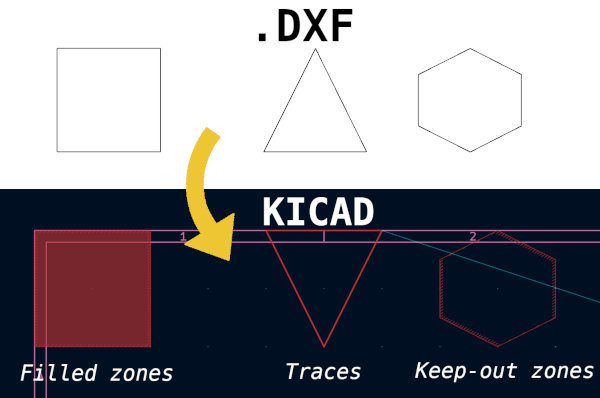
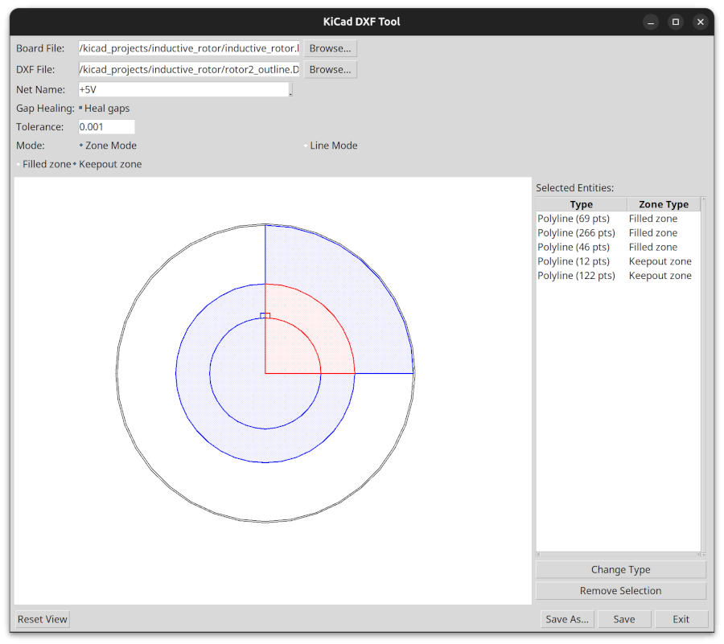

# Kicad DXF Tools


This is a GUI-based Python script for selecting and adding parts of DXF files to KiCad PCB files. 

The tool has modes for selecting enclosed areas and for selecting lines. Enclosed areas can be added to a KiCad PCB as copper zones or as keepout zones. Lines can be added as tracks. Based on the *.kicad_pcb file you load, you can select which net to assign the tracks or regions to. 



## Usage
The GUI should launch when you run the script:
```python kicakd_dxf_tools.py```

Currently, this is not an addon for KiCad, but a standalone script. You can run it from the command line or from a Python IDE. If enough people find this useful, I may consider making it an addon.

## Compatibility
This has only been tested with Python 3.12.3 and KiCad 9.0 on Ubuntu 24.04. Feel free to open an issue if you encounter any problems with other versions or platforms.
